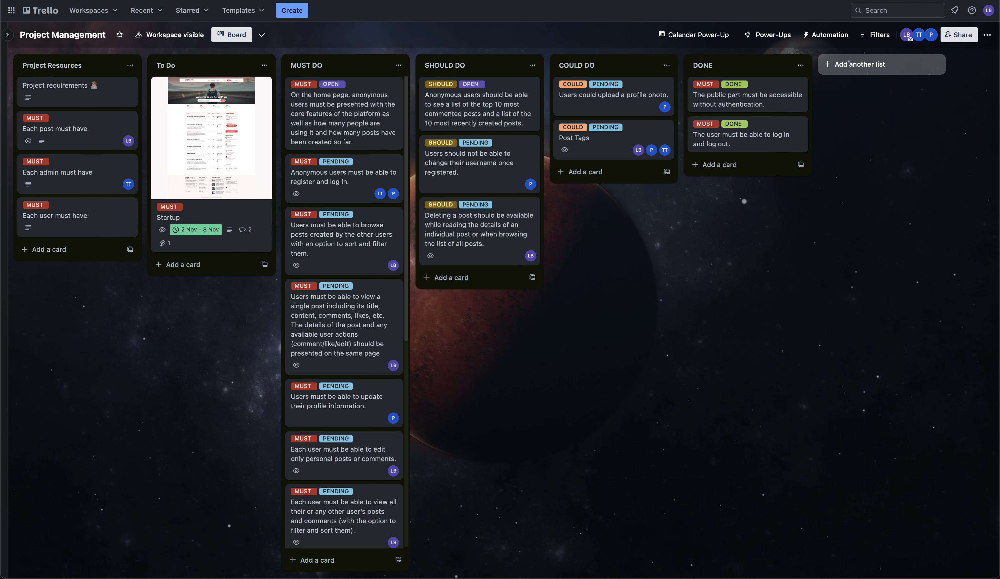
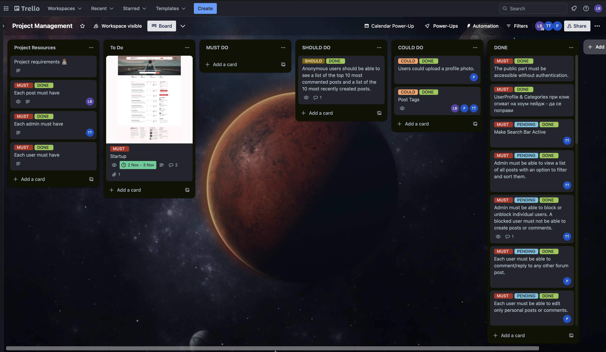

# Forum Project

## Project Description
Design and implement a Forum System where users can create posts, add comments, and upvote/downvote content related to a specific topic. The forum revolves around Apple products.

## Table of Contents
### Functionalities
- - [Functionalities](#Functionalities)
- - [Entities](#Entities)
- - [Public Part](#Public-Part)
- - [Private Part](#Private-Part)
- - [Administrative Part](#Administrative-Part)
- - [Firebase Realtime Database](#Firebase-Realtime-Database)
- - [Example use cases](#Example-use-cases)

#### Entities
- Authentication is handled by Firebase.
- Each user and admin CAN have a first and last name, email, and may have a phone number.
- Each post can have a user who created it, a title, content, comments, and likes.
#### Public Part
- Anonymous users can register and log in.
- Anonymous users can see the core features of the platform, number of users, and number of posts.
- Anonymous users can see the top 10 most commented posts and the 10 most recently created posts.
#### Private Part
- Users can log in and log out.
- Users can browse and sort posts created by other users.
- Users can view a single post and its details.
- Users can update their profile information and upload a profile photo.
- Users can create a new post and edit their own posts or comments.
- Users can view all their or any other user’s posts and comments.
- every post can contains tags for easier navigation.
- Users can add/remove/edit tags only on their own posts.
- Admins can do so on all posts.
#### Administrative Part
- Admins can search for a user by username, email, or display name.
- Admins can block or unblock individual users.
- Admins can delete any post and view a list of all posts.
- Admin can view a list of all posts with an option to filter and sort the
#### Firebase Realtime Database
- All data is stored in a NoSQL database hosted by Google Firebase.
### Example use cases
#### Scenario 1

A friend of Pavel’s told him about this amazing forum, where lots of people share their ideas and perspectives on the crypto/stock market. Pavel enters the website and sees a feed of posts. He can sort them by most liked or newest. He can also filter them by a certain word/s. He is an anonymous user so he cannot create a post yet. He registers and then logs in to the forum. He can now start sharing his ideas with his buddy crypto “holders.”  

#### Scenario 2

Your forum has accumulated thousands of new users. Most of them are proactively helpful and positive, but some of them started posting spam or/and irrelevant information to the forum. You hire a moderator. You instruct the moderator to enter the forum and create a first-time registration. You as an admin give admin rights to your moderator through the forum. They can now start deleting posts and ban users that do not follow the forum rules!

### Getting Started
#### Prerequisites
[Node.js]
[Firebase account]

Installation
Clone the repository.
Install dependencies: npm install.
[Other steps...]
# Forum System

## Project Description

Design and implement a Forum System where users can create posts, add comments, and upvote/downvote content related to a specific topic. The forum revolves around [your chosen topic(s)].

## Table of Contents

- [Forum Project](#forum-project)
  - [Project Description](#project-description)
  - [Table of Contents](#table-of-contents)
    - [Functionalities](#functionalities)
      - [Entities](#entities)
      - [Public Part](#public-part)
      - [Private Part](#private-part)
      - [Administrative Part](#administrative-part)
      - [Firebase Realtime Database](#firebase-realtime-database)
    - [Example use cases](#example-use-cases)
      - [Scenario 1](#scenario-1)
      - [Scenario 2](#scenario-2)
    - [Getting Started](#getting-started)
      - [Prerequisites](#prerequisites)
- [Forum System](#forum-system)
  - [Project Description](#project-description-1)
  - [Table of Contents](#table-of-contents-1)
  - [Functional Requirements](#functional-requirements)
    - [Entities (documents)](#entities-documents)
    - [Public Part](#public-part-1)
    - [Private Part](#private-part-1)
    - [Administrative Part](#administrative-part-1)
    - [Optional Feature](#optional-feature)
    - [Firebase Realtime Database](#firebase-realtime-database-1)
  - [Use Cases](#use-cases)
    - [Scenario 1](#scenario-1-1)
    - [Scenario 2](#scenario-2-1)
    - [Prerequisites](#prerequisites-1)
    - [Installation](#installation)
  - [Usage](#usage)
  - [Teamwork and Collaboration](#teamwork-and-collaboration)

## Functional Requirements

### Entities (documents)

- Authentication is handled by Firebase.
- Each user and admin CAN have a first and last name, email, and may have a phone number.
- Each post can have a user who created it, a title, content, comments, and likes.

### Public Part

- Anonymous users can register and log in.
- Anonymous users can see the core features of the platform, number of users, and number of posts.
- Anonymous users can see the top 10 most commented posts and the 10 most recently created posts.

### Private Part

- Users can log in and log out.
- Users can browse and sort posts created by other users.
- Users can view a single post and its details.
- Users can update their profile information and upload a profile photo.
- Users can create a new post and edit their own posts or comments.
- Users can view all their or any other user’s posts and comments.
- every post can contains tags for easier navigation.
- Users can add/remove/edit tags only on their own posts.
- Admins can do so on all posts.

### Administrative Part

- Admins can search for a user by username, email, or display name.
- Admins can block or unblock individual users.
- Admins can delete any post and view a list of all posts.
- Admin can view a list of all posts with an option to filter and sort the

### Optional Feature

- Post Tags for easier navigation.
- Users can add/remove/edit tags only on their own posts. Admins can do so on all posts.

### Firebase Realtime Database

- All data is stored in a NoSQL database hosted by Google Firebase.

## Use Cases

### Scenario 1

A friend of Pavel’s told him about this amazing forum, where lots of people share their ideas and perspectives on the crypto/stock market. Pavel enters the website and sees a feed of posts. He can sort them by most liked or newest. He can also filter them by a certain word/s. He is an anonymous user so he cannot create a post yet. He registers and then logs in to the forum. He can now start sharing his ideas with his buddy crypto “holders.”  
### Scenario 2

Your forum has accumulated thousands of new users. Most of them are proactively helpful and positive, but some of them started posting spam or/and irrelevant information to the forum. You hire a moderator. You instruct the moderator to enter the forum and create a first-time registration. You as an admin give admin rights to your moderator through the forum. They can now start deleting posts and ban users that do not follow the forum rules!

### Prerequisites

  - Node.js
  -  Firebase account

### Installation

1. Clone the repository.
2. Install dependencies: `npm install`.
3. run the project: `npm run dev`. 

## Usage

1. Account Creation:
Register:

Visit the forum's homepage.
Click on the "Register" or "Sign Up" button.
Fill in the required information, including your username, email, and password.
Complete the registration process.
Log In:

If you already have an account, click on the "Log In" button.
Enter your login credentials (username/email and password).

2. Forum Navigation:
Explore Categories:

Navigate through different forum categories to find topics of interest.
Categories may include General Discussion, Technology, Sports, etc.
Browse Recent Posts:

Check the latest posts displayed on the forum's homepage.

3. Participating in Discussions:
Create a New Topic:

Navigate to the appropriate category.
Click on "New Topic" or a similar button.
Provide a title and content for your post.
Reply to Topics:

Click on a topic to view the conversation.
Use the "Reply" or "Comment" button to respond to the discussion.
Quoting and Mentioning:

Quote other users' messages to respond directly to specific points.
Use the "@" symbol followed by a username to mention someone in a post.

4. User Profile:
Update Profile Information:

Access your profile settings to update information like your bio, avatar, and signature.

1. Moderation and Reporting:
Report Inappropriate Content:

If you come across inappropriate or offensive content, use the report button to notify moderators.
Moderator Assistance:

Contact forum moderators/admins if you need assistance or encounter issues.

6. Settings and Notifications:

Explore and adjust general forum settings to personalize your experience.

7. Searching and Tags:
Use the Search Bar:

Utilize the search feature to find specific topics or keywords.
Explore Tags (if applicable):

If the forum uses tags, consider exploring topics by clicking on relevant tags.

8. Community Guidelines:
Review Forum Rules:

Familiarize yourself with the forum's rules and guidelines to ensure a positive experience for all users.
Respectful Communication:

Interact with other users respectfully and contribute positively to discussions.
Remember that these instructions provide a general guideline, and you can tailor them to match the specific features and functionalities of your forum.

## Teamwork and Collaboration

- This project was a result of great teamwork and collaboration. Our team effectively managed tasks, tracked progress, and ensured a successful project delivery.
- We utilized tools like Trello to organize our work. Below are a couple of screenshots from our Trello board, showcasing our task management and progress tracking:
- Code:   [in GitHub][1]

[1]: https://github.com/TEAM-1-FIRST-PROJECT/Forum-Project

Trello Board screenshots: 

